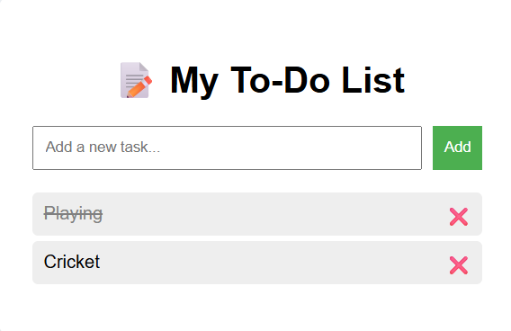

# 📝 To-Do List App

This is a simple **To-Do List Web Application** created using HTML, CSS, and JavaScript. It allows users to add, delete, and mark tasks as complete.

## 🚀 Features

- Add new tasks
- Mark tasks as completed
- Delete tasks
- Fully responsive design

## 🛠️ Technologies Used

- HTML
- CSS
- JavaScript

## 📂 How to Use

1. Clone this repository: https://github.com/prasannjitpanda/todo-list.git
2. Open `index.html` in your browser.
3. Start adding your daily tasks!

## 📸 Screenshot

---

## 👨‍💻 Author

[Prasannjit Panda](https://github.com/prasannjitpanda)